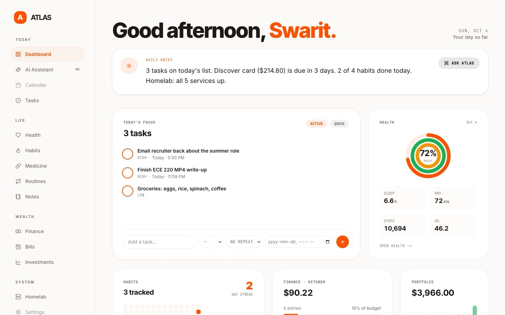
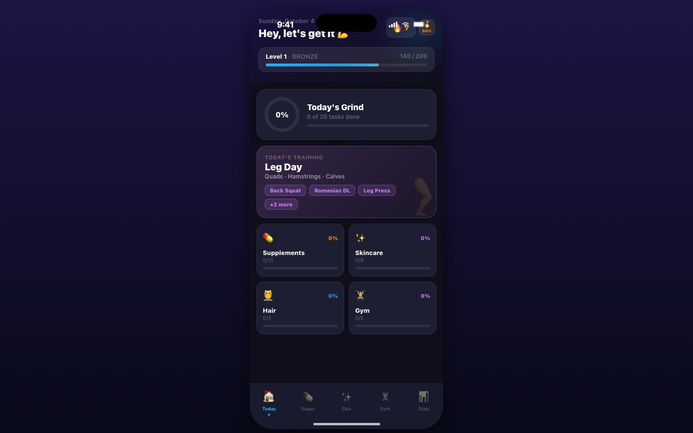

### Hi, I'm Swarit 👋

Computer Engineering student at the **University of Illinois Urbana-Champaign**. I build where circuits meet code, and lately where code meets AI.

### Featured projects

<table>
  <tr>
    <td width="50%" valign="top">
      
      <h4><a href="https://github.com/Swarit07/CAT-TimeMachine">Cat Track: Jobsite Time Machine</a> 🏆</h4>
      A 3D quarry simulator with a memory: replay any second, ask the site in plain English why production was down. Ships an MCP server for AI agents.
        
      <code>React</code> <code>TypeScript</code> <code>three.js</code> <code>MCP</code>
    </td>
    <td width="50%" valign="top">
      
      <h4><a href="https://github.com/Swarit07/career-os">CareerOS</a></h4>
      A job-search command center: kanban application tracking, resume tailoring with a local LLM, live job search and an AI career coach.
        
      ▶ <a href="https://github.com/Swarit07/career-os/blob/main/docs/media/careeros-promo-30s.mp4">Watch the 30s promo</a>
        
      <code>Next.js</code> <code>Supabase</code> <code>Postgres</code> <code>AI SDK</code>
    </td>
  </tr>
  <tr>
    <td width="50%" valign="top">
      
      <h4>AtlasOS 🔒 private</h4>
      A self-hosted life dashboard: health, habits, tasks, money, stocks and homelab in one place, with a Gemini assistant that answers from my own data.
        
      <code>Next.js</code> <code>Postgres</code> <code>Gemini</code> <code>Docker</code>
    </td>
    <td width="50%" valign="top">
      
      <h4>HealthAP 🔒 private</h4>
      A gamified iOS health tracker: supplements, skincare, hair and gym in one daily checklist, with XP, streaks and rank tiers.
        
      <code>SwiftUI</code> <code>Swift</code> <code>iOS</code>
    </td>
  </tr>
</table>

**More builds:** analog PWM motor car (no microcontroller) · vending-machine FSM in Verilog *and* on a breadboard · Arduino × Unity game · OpenCV study-space occupancy counter · systems programs in C and LC-3 assembly · Dockerized homelab

### Experience

**Liebherr Group**, Parts & Warehouse Co-op (2024): ran Kardex automated retrieval systems and shipped orders for customers and suppliers 
**Leadership:** President of Programming Club · organized my high school's first hackathon (Mill Hacks) · DECA chapter executive

### Toolbox

**Languages:** C · C++ · Python · Java · TypeScript · Verilog · LC-3 Assembly 
**Hardware:** Arduino · Raspberry Pi · FPGA (Basys3) · Vivado · KiCad 
**Web & AI:** React · Next.js · three.js · Supabase · Docker · Ollama · Vercel AI SDK · MCP · OpenCV
