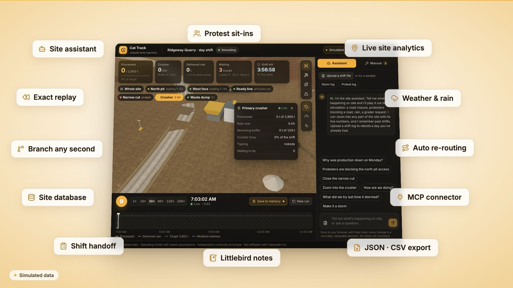
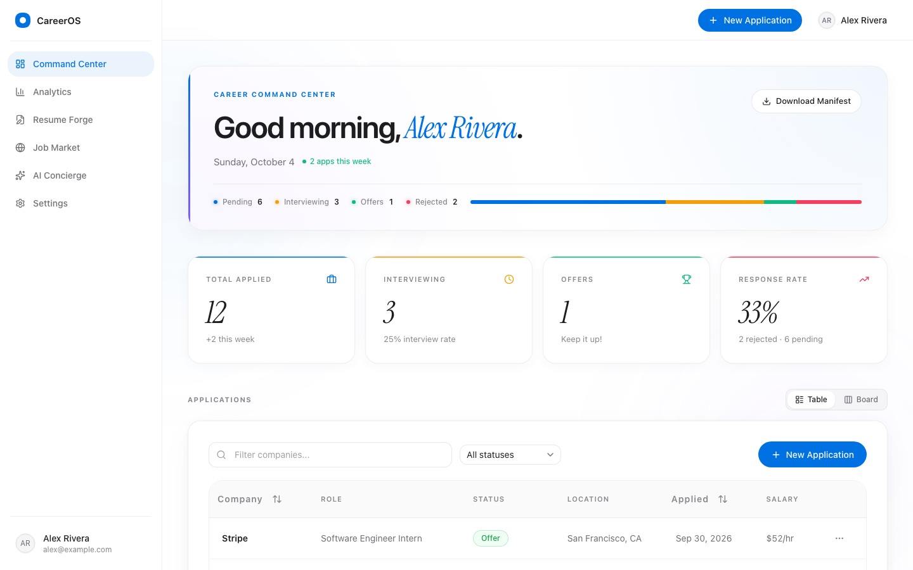

### Hi, I'm Swarit 👋

Computer Engineering student at the **University of Illinois Urbana-Champaign**. I build at the line between hardware and software: embedded systems and digital logic on one side, full-stack apps and AI tooling on the other.

🏆 **1st place, UIUC Product Hackathon 2026** (Caterpillar challenge)
🌐 [Portfolio](https://main-portfolio-lemon.vercel.app) · [LinkedIn](https://www.linkedin.com/in/swarit-sheel/) · [Devpost](https://devpost.com/Swarit07)

---

### Featured projects

<table>
  <tr>
    <td width="50%" valign="top">
      
      <h4><a href="https://github.com/Swarit07/cat-time-machine">Cat Track: Jobsite Time Machine</a> 🏆</h4>
      A 3D quarry simulator with a memory. Replay any second, talk to the site in plain English, and ask why production was down. Includes a deterministic engine with exact replay, a simulated past-week database, and an MCP server for AI agents.
        
      <code>React</code> <code>TypeScript</code> <code>three.js</code> <code>MCP</code> · 74 tests
    </td>
    <td width="50%" valign="top">
      
      <h4><a href="https://github.com/Swarit07/career-os">CareerOS</a></h4>
      A job-search command center. Track applications in a table or kanban, tailor your resume to a role with a local LLM, search live listings, and chat with an AI coach that knows your pipeline.
        
      <code>Next.js 16</code> <code>Supabase</code> <code>PostgreSQL + RLS</code> <code>AI SDK</code>
    </td>
  </tr>
</table>

**More:** [my portfolio site](https://github.com/Swarit07/MainPortfolio) (Next.js, static export) · hardware labs (a PWM motor car, an FSM on FPGA and on a breadboard, Arduino + Unity) · systems work in C and LC-3 assembly

### Toolbox

**Languages:** C · C++ · Python · Java · C# · TypeScript / JavaScript · Verilog · LC-3 Assembly
**Hardware:** Arduino · Raspberry Pi · FPGA (Basys3) · Xilinx Vivado · KiCad · oscilloscope and breadboard prototyping
**Web & AI:** React · Next.js · three.js · Supabase / Postgres · Tailwind · Vercel AI SDK · MCP
**Interests:** embedded systems, robotics, computer vision, digital logic
